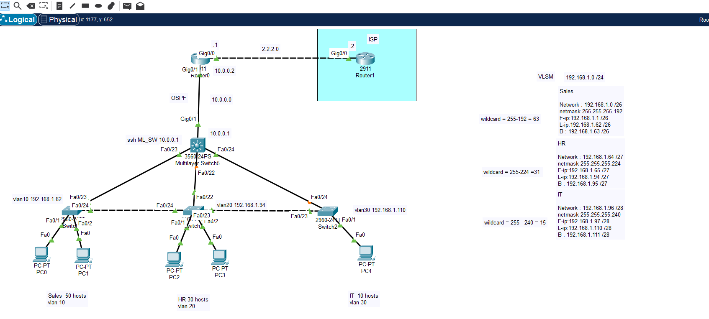

# Secure-Efficient-LAN-Project
Notice:
Username: cisco
Password: cisco
This is used for SSH, console access, and enable mode on all devices in the network.

I designed and implemented a fully segmented network using VLSM and created three VLANs: HR, Sales, and IT. To improve network efficiency and management, 
I:
Configured DHCP on a multilayer switch to serve IP addresses locally, reducing latency and speeding up the network.
Enabled SSH on all devices for secure remote administration.
Optimized switch ports with PortFast and Port Security (Sticky MAC) for faster connections and enhanced security.
Implemented OSPF as the dynamic routing protocol between VLANs.
Configured PAT (Port Address Translation) to allow network users to access the Internet while keeping internal IPs private.

